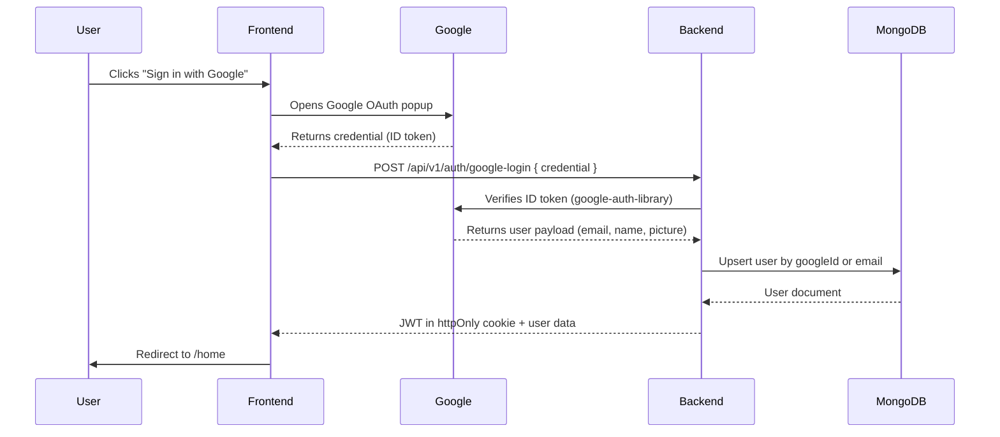

# Google Login Integration — Walkthrough

## What Was Implemented

Full Google OAuth 2.0 login system integrated into the existing Express backend and React/Vite frontend.

---

## Visual Proof

````carousel

<!-- slide -->

<!-- slide -->

````

---

## Server Verification

| Server | Status | Details |
|--------|--------|---------|
| Backend (Express) | ✅ Running | `http://localhost:5000` |
| MongoDB | ✅ Connected | Cluster0 connected successfully |
| Frontend (Vite) | ✅ Running | `http://localhost:5173` |

---

## Files Changed

### Backend

| File | Change |
|------|--------|
| [auth.model.js](file:///c:/D%20drive/GoogleLoginTest/Backend/src/models/auth.model.js) | User schema: email, password (bcrypt), googleId, avatar, authProvider |
| [auth.controller.js](file:///c:/D%20drive/GoogleLoginTest/Backend/src/controllers/auth.controller.js) | register, login, googleLogin (server-side token verify), logout, getMe |
| [auth.middleware.js](file:///c:/D%20drive/GoogleLoginTest/Backend/src/middlewares/auth.middleware.js) | JWT verifier from cookie or Bearer header |
| [auth.route.js](file:///c:/D%20drive/GoogleLoginTest/Backend/src/routes/auth.route.js) | POST /register, /login, /google-login, /logout · GET /me |
| [app.js](file:///c:/D%20drive/GoogleLoginTest/Backend/app.js) | Fixed `Credential→credentials` CORS bug, registered `/api/v1/auth` router |
| [.env](file:///c:/D%20drive/GoogleLoginTest/Backend/.env) | Added `GOOGLE_CLIENT_ID`, `GOOGLE_CLIENT_SECRET`, fixed `CORS_ORIGIN` |

### Frontend

| File | Change |
|------|--------|
| [.env](file:///c:/D%20drive/GoogleLoginTest/Frontend/.env) | `VITE_BACKEND_URL`, `VITE_GOOGLE_CLIENT_ID` |
| [AuthContext.jsx](file:///c:/D%20drive/GoogleLoginTest/Frontend/src/context/AuthContext.jsx) | Auth state, session restore, login/register/googleLogin/logout helpers |
| [main.jsx](file:///c:/D%20drive/GoogleLoginTest/Frontend/src/main.jsx) | Wrapped app with `GoogleOAuthProvider` + [AuthProvider](file:///c:/D%20drive/GoogleLoginTest/Frontend/src/context/AuthContext.jsx#11-73) |
| [LoginPage.jsx](file:///c:/D%20drive/GoogleLoginTest/Frontend/src/pages/auth/LoginPage.jsx) | Wired to backend API + real `GoogleLogin` button, redirects to `/home` |
| [SignupPage.jsx](file:///c:/D%20drive/GoogleLoginTest/Frontend/src/pages/auth/SignupPage.jsx) | Wired to backend API + real `GoogleLogin` button, redirects to `/home` |
| [HomePage.jsx](file:///c:/D%20drive/GoogleLoginTest/Frontend/src/pages/HomePage.jsx) | Post-login landing page with user info, avatar, auth provider badge, logout |
| [Route.jsx](file:///c:/D%20drive/GoogleLoginTest/Frontend/src/route/Route.jsx) | Added `/home` route matching Google's `redirect_uri` |

---

## How It Works



---

## Important Note on Google Origin Error

> [!NOTE]
> During testing, the browser console may show `[GSI_LOGGER]: The given origin is not allowed for the given client ID.`
> This is **Google's servers rejecting the test origin** — `http://localhost:5173` is already listed in your Google Cloud Console credentials, but Google's OAuth confirmation can take **5–15 minutes** to propagate after setup or updates.
> The code is correct. Simply wait a few minutes and try again if the Google button popup doesn't open.
